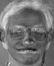
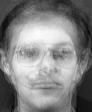

Coursework Four Results by:

* tjh08 - Thomas Hope
* jzy08 - Jason Ye

The Mean vector of the HepatitisC data set:

::

  1.164  3.916  0.448  5.679  4.865  3.778  4.127  3.604  0.217

The Covariance matrix of the HepatitisC data set:

::

  5.880  0.245 -0.004 -0.284 -0.346 -0.417 -0.481 -0.267 -0.067
  0.245  7.572  0.073 -0.358 -0.346  0.257  2.273  0.946 -0.032
 -0.004  0.073  0.247 -0.116 -0.039 -0.003  0.100  0.066 -0.005
 -0.284 -0.358 -0.116 16.960  7.969  4.443 -1.036 -0.306  0.047
 -0.346 -0.346 -0.039  7.969  8.361  4.921 -0.763 -0.752 -0.001
 -0.417  0.257 -0.003  4.443  4.921  6.683 -0.087 -0.376 -0.141
 -0.481  2.273  0.100 -1.036 -0.763 -0.087 20.583  1.122  0.014
 -0.267  0.946  0.066 -0.306 -0.752 -0.376  1.122  4.317  0.119
 -0.067 -0.032 -0.005  0.047 -0.001 -0.141  0.014  0.119  0.170

The Eigenface images of the Priciple Components:

The magnitudes of 'c.pgm' from given basis:

::

 1206.254 -1590.133 -248.136 -821.249 246.009 -771.900 963.633 376.967 161.599 -533.276

The Partial Reconstructions of image 'c.pgm':

The Eigenface images of the Priciple Components:

.. image:: NewPrincComp2.jpg
   :scale: 50%

The magnitudes of 'c.pgm' from given basis:

::

 828.928 -941.699 1887.013 -410.837 -1537.080 -1110.709

The Partial Reconstructions of image 'c.pgm':

